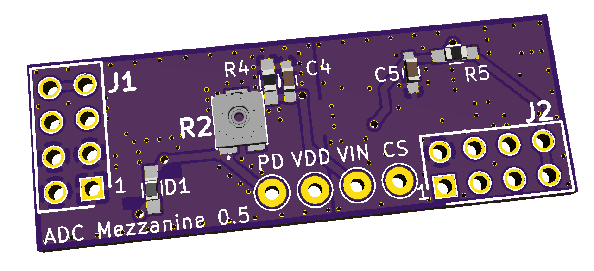
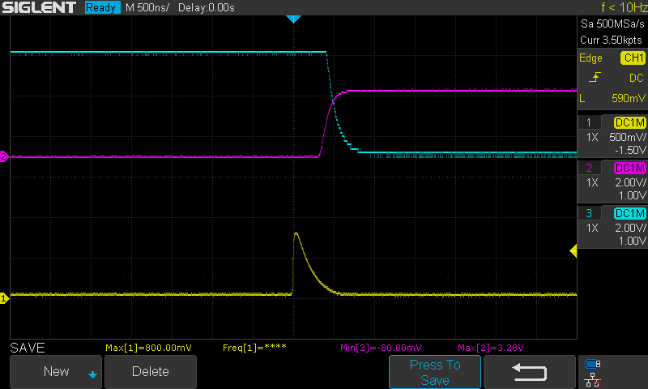
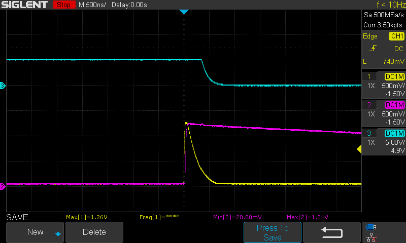
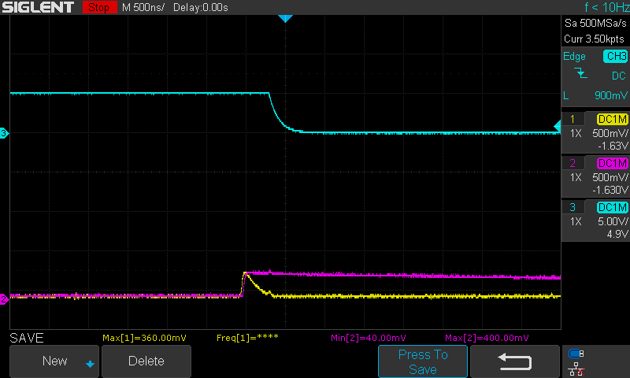
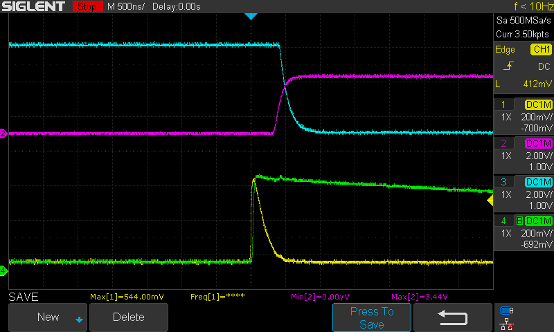
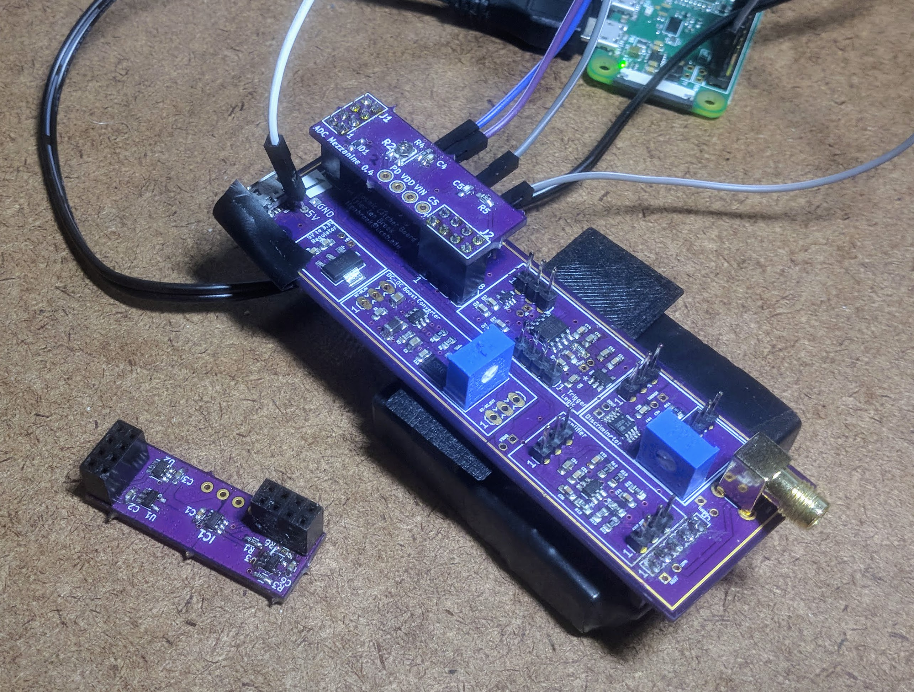

# ADC Mezzanine Board
 ADS7886 ADC Mezzanine Board for PHYS150
 
 

 KiCad PCB files are contained in the "ads7886_PCB" folder. If you do not have KiCad, see the "images" folder for the schematic and PCB. "ADC_Reader.py" is a basic python script for interfacing with the ADC board using a Raspberry Pi.
 
 ## The Hardware
 
The board has 4 main sections: power supply, analog input, digital input ("CS timing"), and ADC. 

#### Power Supply:
Power is regulated to 3.3V from the 5V board connectors. This circuit is about as boring as it gets. There isn't even a dedicated output capacitor on the LDO since the loads' decoupling capacitors are so close to the output.

#### Analog Input:
The ADC itself, under ideal conditions, is capped at 1 MSPS (million samples per second), which means that it is too slow to measure the entirety of a pulse. The board uses a peak detector to isolate the maximum voltage of a given event instead. 

**R2** is a 100Ω trimpot which stabilizes the op-amp and isolates it from the capacitive load. If this value is too low, the peak detector may oscillate and overshoot the actual value of the peak. If it is too high, the capacitor may not charge quickly enough and the peak detector will undershoot. An ideal value is around 10-20Ω, though you may want to adjust it using the scope. 

**R4** and **C4** form an RC decay. The given values, 1nF and 1MΩ, correspond to a time constant of 1ms. The value of R4 may be lowered to make the voltage decay more quickly. It is preferable to tweak **R4** rather than **C4** because the capacitive load may change the behavior of the op-amp and schottky diode.

#### Digital Input:
The latch signal from the main board is the output of a one-shot which is triggered every time the input signal exceeds a certain threshold. However, the ADC itself takes a measurement when its CS input transitions from high to low. The latch signal is inverted (to make it function like CS) and delayed using **R3** and **C5** (so that measurements are always taken *after* the peak has passed. This delay corresponds to roughly 250ns to fall from logical high to logical low using the given values.
 
#### The ADC:
The datasheet for the ADS7886 is available [here](http://www.ti.com/lit/ds/symlink/ads7886.pdf). 

#### Test Points
There are 4 test points on the board. **CS** is the chip select (trigger) input to the ADC. **Vin** is the analog input to the ADC, the voltage that is being measured. **PD** is across the trimpot from **Vin**; measuring accross these two points will give the value of **R2**. **VDD** is connected to the mezzanine board's 3.3V power supply.

 ## The Software

 This script listens for output data from the ADC and saves it to a file named "ADC_Data.txt".
 As is, connect SCLK to pin 31, HOLD to pin 29, and SDO to pin 33. On the Pi, navigate in the terminal to the directory the script is in, then run "python ADC_Reader.py". The code will begin 
 
 The code only saves data to the file every once in a while since accessing the file takes a nontrivial amount of time. This can be changed by changing the value of "BufferSize" in the code.
 
 The code is heavily commented, so for finer details it's probably better to check there. 
 
 ## Images
 
 
 
 In yellow is the raw signal. In purple is the 3.3V signal coming out of the Cosmic board's discriminator+oneshot. In cyan is the CS signal generated by the ADC: inverted, slightly RC-delayed, 5V.
 
 
 
 
 The peak detector ever-so-slightly undershoots the peak, which is the most ideal response. These images were taken from a modified board with a peak detector time constant of 10µs. Somewhat interesting is the appearance of a small blip in the analog signals at the same time as the digital transition, implying that the supplies (or the grounds) could have been better isolated.
 
 
 
 All of the above signals put together. Input signal in yellow, Peak Detector (test point VIN) in green, Oneshot in purple, CS in cyan.
 
 
 
 An ADC board installed, alongside another ADC board flipped upside down.